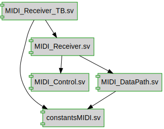

# Documentation for: MIDI_Receiver

Generated by **TerosHDL** © 2020-2021 License GPLv3 Carlos Alberto Ruiz Naranjo (carlosruiznaranjo@gmail.com) Ismael Perez Rojo (ismaelprojo@gmail.com)  Project revision 2021-11-02  

## Designs

- Module: [constantsMIDI ](./doc/doc_internal/constantsMIDI.md)
- Module: [MIDI_Control ](./doc/doc_internal/MIDI_Control.md)
- Module: [MIDI_DataPath ](./doc/doc_internal/MIDI_DataPath.md)
- Module: [MIDI_Receiver ](./doc/doc_internal/MIDI_Receiver.md) (top Module)
- Module: [MIDI_Receiver_TB ](./doc/doc_internal/MIDI_Receiver_TB.md)

## MIDI ([https://users.cs.cf.ac.uk/Dave.Marshall/Multimedia/node158.html](https://users.cs.cf.ac.uk/Dave.Marshall/Multimedia/node158.html))

Structure of MIDI messages:
 - MIDI message includes a status byte and up to two data bytes.
 - Status byte
    - The most significant bit of status byte is set to 1.
    - The 4 low-order bits identify which channel it belongs to (four bits produce 16 possible channels).
     - The 3 remaining bits identify the message.
 - The most significant bit of data byte is set to 0.

MIDI has Channel messages and System messages. 

### Channel messages

|Voice Message          |Status Byte   |Data Byte1         | Data Byte2|
|-------------:         |:-----------: |:-----------------:|:-----------------:|
|Note off               |       8x     | Key number        |  Note Off velocity|
|Note on                |       9x     | Key number        |  Note on velocity|
|Polyphonic Key Pressure|       Ax     | Key number        |  Amount of pressure|
|Control Change         |       Bx     | Controller number |  Controller value|
|Program Change         |       Cx     | Program number    |  None|
|Channel Pressure       |       Dx     | Pressure value    |  None |           
|Pitch Bend             |       Ex     | MSB               |  LSB|

## Implementation
In this module has been implemented *Note on* and *Note off* messages.

### TODO
 - Implement the *Control Change* message.