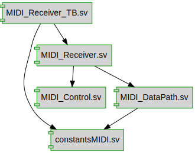

# Documentation for: MIDI_Receiver

Generated by **TerosHDL** © 2020-2021 License GPLv3 Carlos Alberto Ruiz Naranjo (carlosruiznaranjo@gmail.com) Ismael Perez Rojo (ismaelprojo@gmail.com)  Project revision 2021-11-02 15:45:50  

## Designs

- Module: [constantsMIDI ](./doc_internal/constantsMIDI.md)
- Module: [MIDI_Control ](./doc_internal/MIDI_Control.md)
- Module: [MIDI_DataPath ](./doc_internal/MIDI_DataPath.md)
- Module: [MIDI_Receiver ](./doc_internal/MIDI_Receiver.md)
- Module: [MIDI_Receiver_TB ](./doc_internal/MIDI_Receiver_TB.md)

