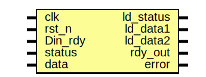
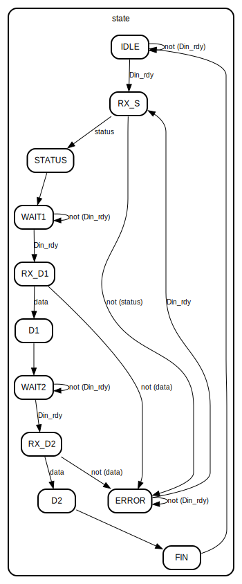

# Entity: MIDI_Control

- **File**: MIDI_Control.sv
## Diagram

## Ports

| Port name | Direction | Type | Description |
| --------- | --------- | ---- | ----------- |
| clk       | input     |      |             |
| rst_n     | input     |      |             |
| Din_rdy   | input     |      |             |
| status    | input     |      |             |
| data      | input     |      |             |
| ld_status | output    |      |             |
| ld_data1  | output    |      |             |
| ld_data2  | output    |      |             |
| rdy_out   | output    |      |             |
| error     | output    |      |             |
## Signals

| Name  | Type                                                                                                                                                                                                                                                                                                                                                                                                                                                                                              | Description |
| ----- | ------------------------------------------------------------------------------------------------------------------------------------------------------------------------------------------------------------------------------------------------------------------------------------------------------------------------------------------------------------------------------------------------------------------------------------------------------------------------------------------------- | ----------- |
| state | enum logic [3:0] { IDLE,  RX_S,  STATUS,  WAIT1,  RX_D1,  D1,  WAIT2,  RX_D2,  D2,  FIN,  ERROR} |             |
## Processes
- unnamed: ( @ (posedge clk) )
  - **Type:** always_ff
## State machines

