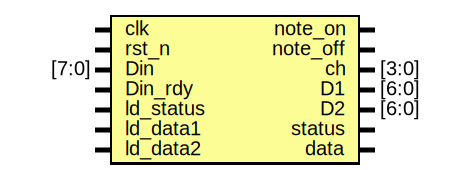

# Entity: MIDI_DataPath

- **File**: MIDI_DataPath.sv
## Diagram

## Ports

| Port name | Direction | Type  | Description |
| --------- | --------- | ----- | ----------- |
| clk       | input     |       |             |
| rst_n     | input     |       |             |
| Din       | input     | [7:0] |             |
| Din_rdy   | input     |       |             |
| ld_status | input     |       |             |
| ld_data1  | input     |       |             |
| ld_data2  | input     |       |             |
| note_on   | output    |       |             |
| note_off  | output    |       |             |
| ch        | output    | [3:0] |             |
| D1        | output    | [6:0] |             |
| D2        | output    | [6:0] |             |
| status    | output    |       |             |
| data      | output    |       |             |
## Signals

| Name | Type        | Description |
| ---- | ----------- | ----------- |
| inst | logic [2:0] |             |
## Processes
- unnamed: ( @ (posedge clk) )
  - **Type:** always_ff
- unnamed: ( @ (posedge clk) )
  - **Type:** always_ff
- unnamed: ( @ (posedge clk) )
  - **Type:** always_ff
- unnamed: ( @ (posedge clk) )
  - **Type:** always_ff
