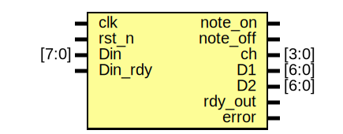

# Entity: MIDI_Receiver

- **File**: MIDI_Receiver.sv
## Diagram

## Ports

| Port name | Direction | Type  | Description |
| --------- | --------- | ----- | ----------- |
| clk       | input     |       |             |
| rst_n     | input     |       |             |
| Din       | input     | [7:0] |             |
| Din_rdy   | input     |       |             |
| note_on   | output    |       |             |
| note_off  | output    |       |             |
| ch        | output    | [3:0] |             |
| D1        | output    | [6:0] |             |
| D2        | output    | [6:0] |             |
| rdy_out   | output    |       |             |
| error     | output    |       |             |
## Signals

| Name      | Type  | Description |
| --------- | ----- | ----------- |
| status    | logic |             |
| data      | logic |             |
| ld_status | logic |             |
| ld_data1  | logic |             |
| ld_data2  | logic |             |
## Instantiations

- control: MIDI_Control
- dataPath: MIDI_DataPath
